# Medical Insurance Cost Prediction

An end-to-end machine learning project that predicts annual medical insurance
charges from a person's age, BMI, number of children, gender, smoking status,
and region. The fitted model is a multiple **Linear Regression** model, and the
interactive prediction application is built with **Gradio**.

> This is an educational demonstration. Its estimates are not medical,
> financial, or insurance advice.

## Live project

- **Application:** HUGGING_FACE_SPACE_URL
- **Source code:** GITHUB_REPOSITORY_URL
- **Complete notebook:**
  [`notebooks/Medical_Insurance_Cost_Prediction.ipynb`](notebooks/Medical_Insurance_Cost_Prediction.ipynb)

## Problem statement

Medical insurance charges vary with demographic and lifestyle factors. This
project builds an interpretable regression model that estimates individual
charges and examines which available factors have the strongest linear
relationships with cost.

## Dataset

The project uses the **Medical Cost Personal Dataset**, published on
[Kaggle](https://www.kaggle.com/datasets/mirichoi0218/insurance) and included in
this repository as [`data/insurance.csv`](data/insurance.csv) for
reproducibility. It contains 1,338 observations and seven columns.

| Column | Type | Description |
|---|---|---|
| `age` | Numeric | Age of the primary beneficiary |
| `sex` | Categorical | Female or male |
| `bmi` | Numeric | Body mass index |
| `children` | Numeric | Number of covered dependents |
| `smoker` | Categorical | Smoking status |
| `region` | Categorical | Northeast, northwest, southeast, or southwest |
| `charges` | Numeric | Individual billed medical charges in USD (target) |

## Workflow

### 1. Data inspection and cleaning

- Confirmed the original shape: **1,338 rows × 7 columns**.
- Found **no missing values**.
- Found and removed **one duplicated row**, leaving 1,337 records.
- Kept `charges` as the numerical prediction target.

### 2. Preprocessing

The categorical variables were one-hot encoded with `drop_first=True`. Boolean
dummy columns were converted to integers. No feature scaling was applied because
ordinary least squares Linear Regression does not require it for predictions.

The final eight model inputs, in their required order, are:

```text
age, bmi, children, sex_male, smoker_yes,
region_northwest, region_southeast, region_southwest
```

`Female`, `No`, and `Northeast` are the baseline categories. Selecting
Northeast therefore leaves every region indicator equal to zero.

### 3. Exploratory data analysis

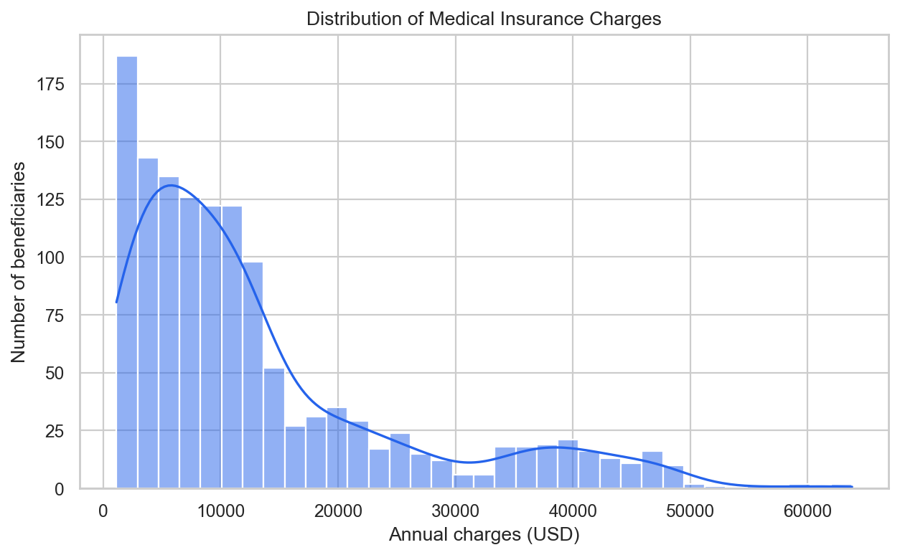

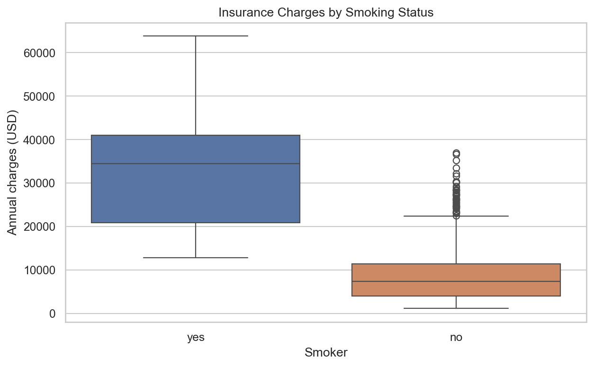

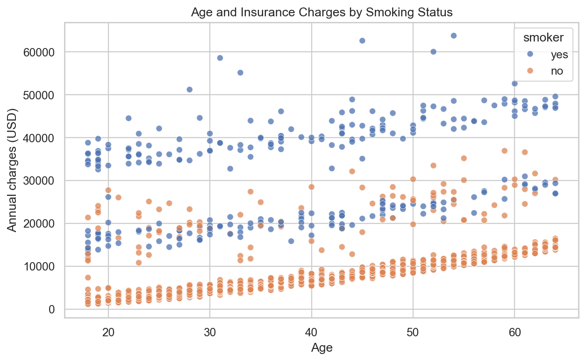

Important findings from the actual dataset:

- **Smoking is the strongest observed cost driver.** `smoker_yes` has a 0.7872
  correlation with charges and the fitted coefficient is approximately
  **+$23,077.76**, holding other inputs constant.
- **Age has a consistent positive effect.** Its fitted coefficient is about
  **+$248.21 per year**, holding other features constant.
- **BMI also increases the linear estimate.** Its coefficient is approximately
  **+$318.70 per BMI unit**.
- **Children has a smaller positive coefficient** of approximately +$533.01 per
  covered dependent.
- The gender and regional coefficients are small relative to smoking status.
  These are associations in this dataset, not causal conclusions.

### 4. Training

The cleaned data was split with `train_test_split(test_size=0.2,
random_state=42)`:

- Training set: **1,069 records**
- Test set: **268 records**
- Model: `sklearn.linear_model.LinearRegression`

The committed [`insurance_model.pkl`](insurance_model.pkl) and
[`feature_columns.pkl`](feature_columns.pkl) were exported directly from the
trained Google Colab runtime. Exact training settings, library versions, and
unrounded metrics are recorded in [`model_metadata.json`](model_metadata.json).

### 5. Evaluation

| Metric | Test result |
|---|---:|
| Mean Absolute Error (MAE) | **$4,177.05** |
| Mean Squared Error (MSE) | **35,478,020.68** |
| Root Mean Squared Error (RMSE) | **$5,956.34** |
| R² score | **0.8069** |

The R² result means the model explains approximately **80.69%** of the
variation in charges in the held-out test set. RMSE is higher than MAE because
large prediction errors receive more weight. The actual-versus-predicted chart
also shows that a simple linear model struggles with some high-cost cases.

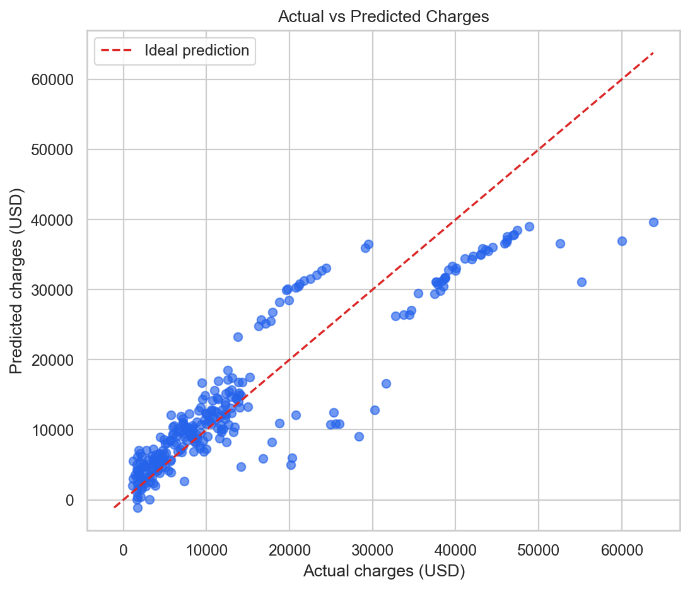

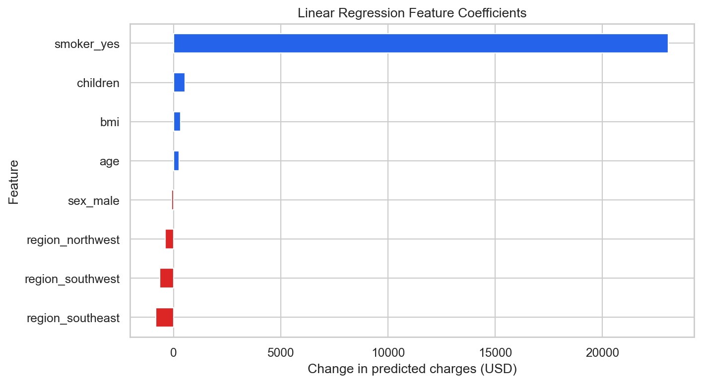

All 268 test-set predictions are available in
[`results/test_predictions.csv`](results/test_predictions.csv), and the
machine-readable evaluation summary is in
[`results/evaluation_summary.json`](results/evaluation_summary.json).

## Prediction application

The Gradio application validates user input, reproduces the training-time
encoding, checks the saved feature order, loads the exact Colab model, and
formats the resulting estimate as USD.

Two verified application cases are:

| Case | Age | BMI | Children | Gender | Smoker | Region | Prediction |
|---|---:|---:|---:|---|---|---|---:|
| Non-smoker | 25 | 22.5 | 0 | Female | No | Northeast | **$2,283.40** |
| Smoker | 45 | 31.2 | 2 | Male | Yes | Southeast | **$33,223.64** |

The inputs and results are also saved in
[`results/application_test_cases.csv`](results/application_test_cases.csv).

## Screenshot evidence

### Deployed application and working predictions

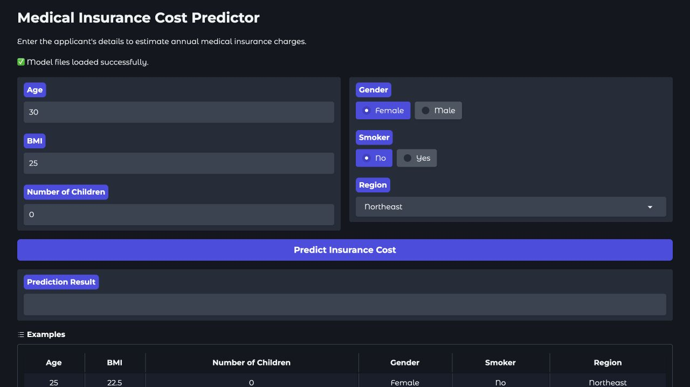

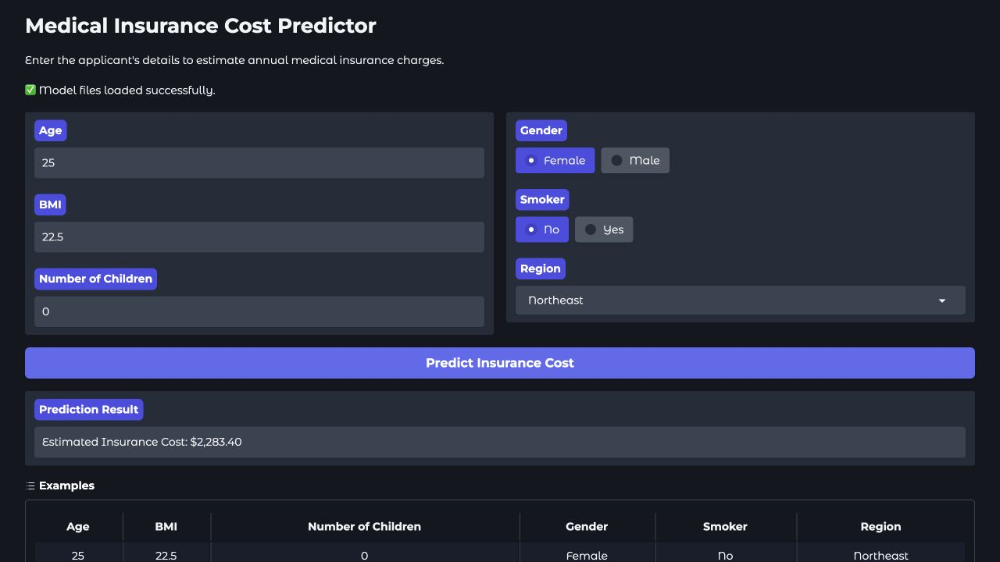

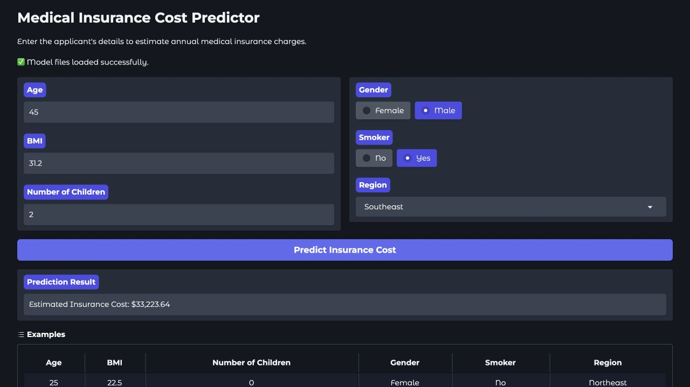

### GitHub repository, README, and final structure

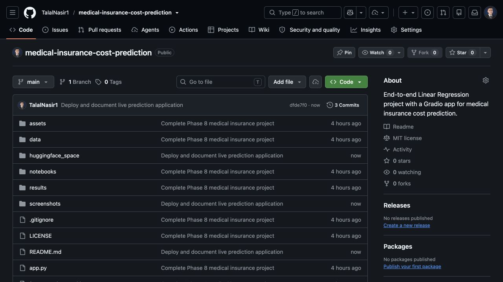

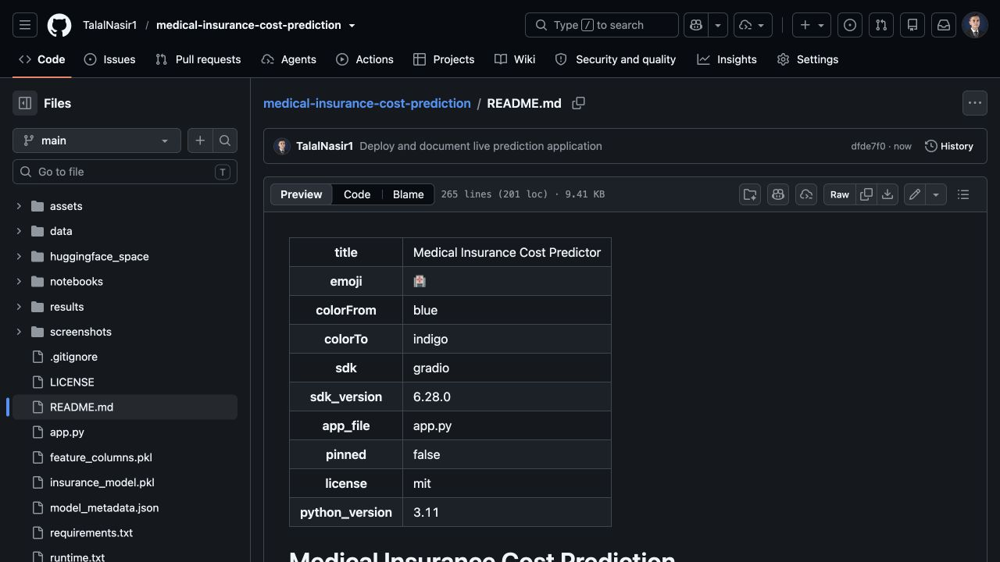

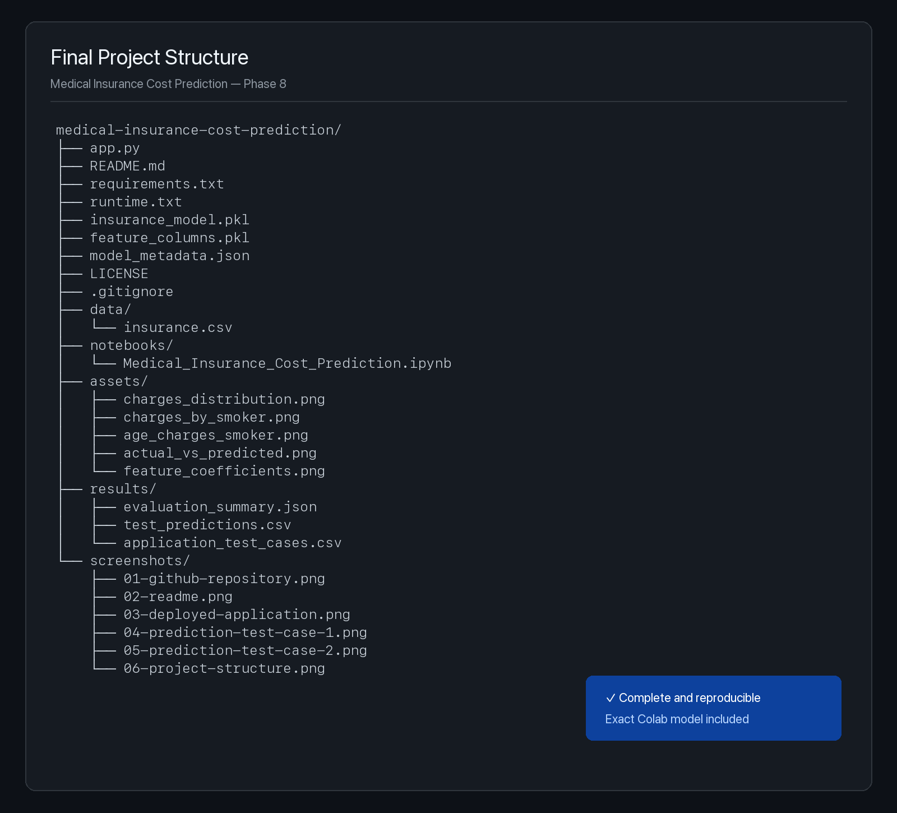

## Project structure

```text
medical-insurance-cost-prediction/
├── app.py
├── insurance_model.pkl
├── feature_columns.pkl
├── model_metadata.json
├── requirements.txt
├── runtime.txt
├── README.md
├── LICENSE
├── data/
│   └── insurance.csv
├── notebooks/
│   └── Medical_Insurance_Cost_Prediction.ipynb
├── assets/
│   ├── charges_distribution.png
│   ├── charges_by_smoker.png
│   ├── age_charges_smoker.png
│   ├── actual_vs_predicted.png
│   └── feature_coefficients.png
├── results/
│   ├── application_test_cases.csv
│   ├── evaluation_summary.json
│   └── test_predictions.csv
└── screenshots/
    ├── 01-github-repository.png
    ├── 02-readme.png
    ├── 03-deployed-application.png
    ├── 04-prediction-test-case-1.png
    ├── 05-prediction-test-case-2.png
    └── 06-project-structure.png
```

## Run locally

```bash
python -m venv .venv
source .venv/bin/activate        # Windows: .venv\Scripts\activate
pip install -r requirements.txt
python app.py
```

Open `http://127.0.0.1:7860` in a browser.

## Deploy to Hugging Face Spaces

1. Create a new Space and select **Gradio** as the SDK.
2. Upload or push the repository files to the Space.
3. Keep `app.py`, both `.pkl` files, `requirements.txt`, and this README at the
   repository root.
4. Wait for the Space status to become **Running**.
5. Test both documented prediction cases and add the final Space URL above.

The exact model environment is pinned in `requirements.txt`. If the model is
exported again from a different Colab environment, update the version pins to
match the new `model_metadata.json`.

## Limitations

- Linear Regression assumes additive linear relationships and does not directly
  model interactions such as smoking combined with high BMI.
- The source data contains only 1,337 unique records and a limited set of
  demographic and lifestyle variables.
- Medical history, coverage level, provider network, location-specific pricing,
  and changes over time are absent.
- The model can produce unrealistic values for inputs far outside the training
  distribution and should not be used for real underwriting.
- Dataset associations do not prove that any feature causes higher charges.

## Reproducibility

The notebook contains the complete preprocessing, visual analysis, model
training, evaluation, prediction, and artifact-export workflow. The dataset,
model artifacts, exact feature order, environment versions, test predictions,
and application code are included so another person can reproduce and inspect
the complete result.

## License

Released under the [MIT License](LICENSE).
